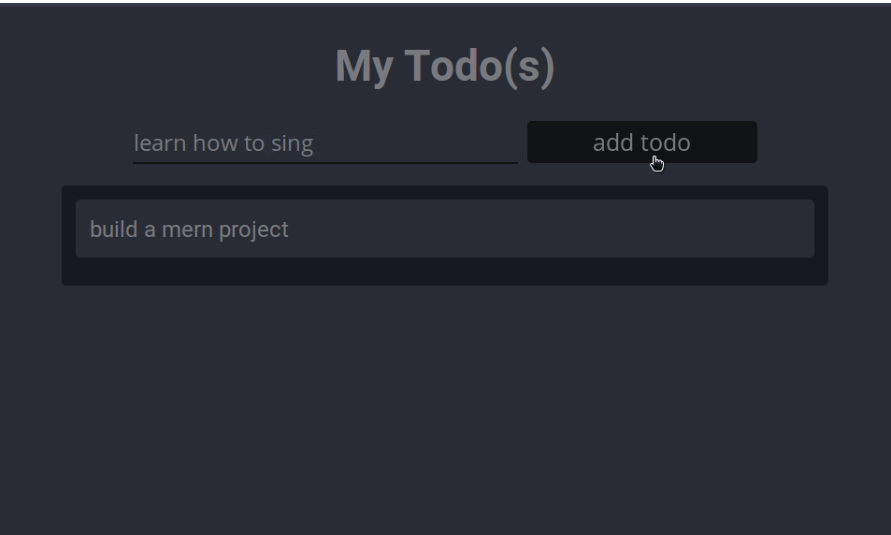

# PROJECT 3: SIMPLE TO-DO  APPLICATION ON MERN WEB STACK
## Task:  To deploy a simple To-Do application that creates To-Do lists like this.
***

***
MERN Web stack consists of the following components:
MongoDB: A document-based, No-SQL database used to store application data in a form of documents.
ExpressJS: A server-side Web Application framework for Node.js.
ReactJS: A frontend framework developed by Facebook. It is based on JavaScript, used to build User Interface (UI) components.
Node.js: A JavaScript runtime environment. It is used to run JavaScript on a machine rather than in a browser.
***
Update and Upgrade Ubuntu: 
```
Code: sudo apt update 
code: sudo apt upgrade
```
***
Installing Node.js- A JavaScript runtime environment. It is used to run JavaScript on a machine rather than in a browser.

```
Code:sudo apt-get install -y nodejs
```
this code installs both node.js and npm (NPM is a package manager for node)
***

 A new directory for the Todo list project was created, project was initialised to create the 

```
code: mkdir Todo
```
***
Next, you will use the command npm init to initialise your project, so that a new file named package.json will be created. This file will normally contain information about your application and the dependencies that it needs to run

```
code: npm init
```
***
INSTALL EXPRESSJS

Remember that Express is a framework for Node.js, therefore a lot of things developers would have programmed is already taken care of out of the box. Therefore, it simplifies development, and abstracts a lot of low-level details. For example, Express helps to define routes of your application based on HTTP methods and URLs.


```
code: npm install express
code: touch index.js
```
screenshot 12: server up sand and runnining. Inbound rule routed to port 5000
code: node index.js
screenshot 13: welcome to express.js
screenshot 14: mongoose a Node.js package that makes working with mongodb easier succesfully installed in Todo directory.
code:npm install mongoose
screenshot 15: Model directory created, cd into model, Todo file created in the model directory
code: mkdir models && cd models && touch todo.js (all three command above defined in a single line of code using the "&&" operator

MongoDB Database: We need a database where we will store our data. For this, we will make use of mLab. mLab provides MongoDB database as a service solution (DBaaS), so to make life easy, you will need to sign up for shared clusters free account, which is ideal for our use case. Sign up here. Follow the signup process, select AWS as the cloud provider, and choose a region near you.
Screenshot 14: MongoDB set to allow access from anywhere
Screenshot 16: Postman API development client used to test our code without Frontend using RESTful API
frontend creation: Using react to creat the frontend user interface of the To-do app for a Web client (browser) to interact with the application via API. To start out with the frontend of the To-do app, we will use the create-react-app command to scaffold our app.
code: npx create-react-app client
Screenshot 17: Database connected succesfully
Screnshot 18: POST request
Screenshot 19: GET request
FRONTEND CREATION (React)
code: npx create-react-app client
installing concurrently
code: npm install concurrently --save-dev
installing nodemon
code:npm install nodemon --save-dev
Screenshot 20: React Logo
Screecnshot 21: Proxy line in package.json
Screenshot 22: Tod App up and running
